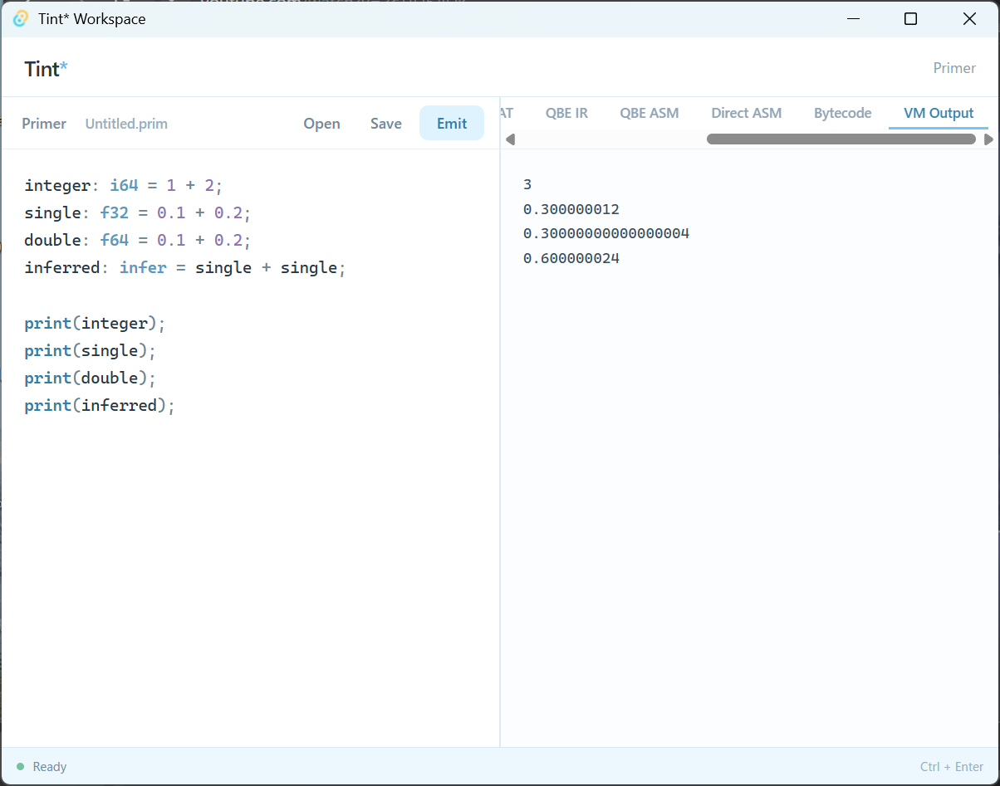

**English** | [日本語](README.ja.md)

# Tint\*

Tint is a small visual development environment for [Primer](https://github.com/Hokutaka/Primer).

It provides a simple place to edit Primer source code and observe the different representations and execution paths generated from it.



```text
Primer source
     │
     ▼
   Tint*
     │
     ├─ C
     ├─ C ASM
     ├─ LLVM IR
     ├─ LLVM ASM
     ├─ WAT
     ├─ QBE IR
     ├─ QBE ASM
     ├─ Direct ASM
     ├─ Bytecode
     └─ VM Output
```

## Features

- Primer syntax highlighting
- Open and save `.prim` files
- Save As
- Rename the current source file
- Generate C
- Generate LLVM IR
- Generate WebAssembly Text (`.wat`)
- Generate QBE IR
- Generate direct x86-64 assembly
- Generate Primer bytecode
- Run Primer bytecode with the Primer VM
- Observe C assembly generated through Clang
- Observe LLVM assembly generated through Clang
- Observe QBE assembly generated through QBE
- Switch between generated representations and execution output
- Primer validation before code generation
- Keyboard shortcuts

## Shortcuts

| Shortcut       | Action  |
| -------------- | ------- |
| `Ctrl+O`       | Open    |
| `Ctrl+S`       | Save    |
| `Ctrl+Shift+S` | Save As |
| `Ctrl+Enter`   | Emit    |

## Requirements

Tint uses the Primer CLI for validation, code generation, and VM execution.

Install Primer first:

```sh
git clone https://github.com/Hokutaka/Primer.git
cd Primer
cargo install --path .
```

Make sure the `primer` command is available in your `PATH`:

```sh
primer --version
```

When developing Primer and Tint together, reinstall Primer after changing the Primer compiler:

```sh
cargo install --path . --force
```

Tint also requires the usual Tauri development dependencies for your platform.

### Clang

The C ASM and LLVM ASM views are generated with Clang.

Make sure `clang` is available in your `PATH`:

```sh
clang --version
```

### QBE

The QBE ASM view uses QBE.

On the current Windows setup, Tint invokes QBE through WSL:

```sh
wsl qbe
```

QBE IR is generated directly by Primer. QBE itself is only used for the QBE ASM view.

If QBE assembly generation is unavailable, the other representations can still be displayed.

## Development

Clone Tint and install the frontend dependencies:

```sh
git clone https://github.com/Hokutaka/Tint.git
cd Tint
npm install
```

Run Tint in development mode:

```sh
npm run tauri dev
```

Build the application:

```sh
npm run tauri build
```

## How it works

Tint intentionally keeps Primer itself outside the application.

When code is emitted, Tint creates a temporary `.prim` source file and calls the installed Primer CLI:

```text
Tint
 │
 ├─ primer check
 ├─ primer emit-c
 ├─ primer emit-llvm
 ├─ primer emit-wat
 ├─ primer emit-qbe
 ├─ primer emit-asm
 ├─ primer emit-bytecode
 └─ primer run
```

Some views are produced directly by Primer:

```text
Primer → C
Primer → LLVM IR
Primer → WAT
Primer → QBE IR
Primer → Direct ASM
Primer → Bytecode
Primer → Bytecode → Primer VM → VM Output
```

Other views intentionally show an additional external transformation:

```text
Primer → C → Clang → C ASM
Primer → LLVM IR → Clang → LLVM ASM
Primer → QBE IR → QBE → QBE ASM
```

The generated representations are captured and displayed directly in Tint.

Temporary files used for external transformations are not part of the Primer source project.

## Design

Tint is intentionally small.

It is not intended to become a full general-purpose IDE. Its purpose is to provide a lightweight visual environment for writing Primer and observing how the same source travels through different lowering and execution paths.

The interface therefore stays focused on two things:

```text
source | representation / output
```

Primer remains responsible for the language, code generation, bytecode, and VM.

External tools remain responsible for their own transformations.

Tint remains the window into them.