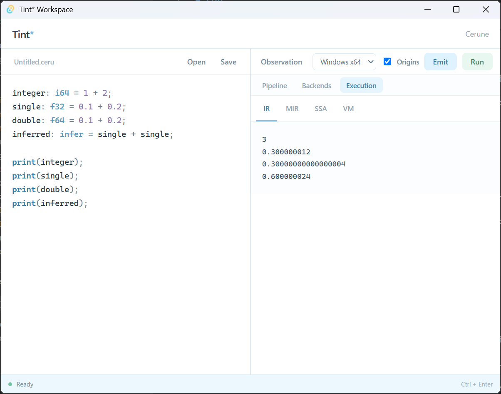

**日本語** | [English](README.en.md)

# Tint*

Tint* は [Cerune](https://github.com/Hokutaka/Cerune) のコード生成過程と実行経路を観測するための、小さなビジュアル環境です。

Cerune のコードを書く。生成する。眺める。

同じソースコードが、Cerune IR、MIR、SSA、各バックエンド、Assembly、Object、Bytecode、そして複数の実行経路へどう変換されていくのかを、ひとつの画面から観察できます。



```text
Cerune source
     │
     ▼
   Tint*
     │
     ├─ Pipeline
     │    ├─ Sources
     │    ├─ Cerune IR
     │    ├─ MIR
     │    └─ SSA
     │
     ├─ Backends
     │    ├─ C
     │    │    ├─ Source
     │    │    └─ ASM
     │    ├─ LLVM
     │    │    ├─ IR
     │    │    └─ ASM
     │    ├─ QBE
     │    │    ├─ IR
     │    │    └─ ASM
     │    ├─ WASM
     │    │    └─ WAT
     │    ├─ Native
     │    │    ├─ ASM
     │    │    └─ Object
     │    └─ VM
     │         └─ Bytecode
     │
     └─ Execution
          ├─ IR
          ├─ MIR
          ├─ SSA
          └─ VM
```

## 機能

- Cerune のシンタックスハイライト
- `.ceru` ファイルを開く / 保存する
- 名前を付けて保存
- 現在のソースファイルをリネーム
- 読み込まれた Sources を表示
- Cerune IR を表示
- MIR を表示
- SSA 化された MIR を表示
- C を生成
- LLVM IR を生成
- WebAssembly Text (`.wat`) を生成
- QBE IR を生成
- x86-64 Assembly を直接生成
- Cerune Bytecode を生成
- Clang を経由して C ASM を観察
- Clang を経由して LLVM ASM を観察
- QBE を経由して QBE ASM を観察
- Windows x64 / Linux x86-64 のターゲットを切り替え
- Origins / Provenance の注釈を表示
- COFF / ELF Object を生成
- Object の Sections / Symbols / Relocations を観察
- Object に残った Origin Symbols を NodeId ごとに観察
- IR / MIR / SSA / VM の実行経路を個別に選択して実行
- Pipeline / Backends / Execution を分離して切り替え
- コード生成前に Cerune で検証
- キーボードショートカット

## ショートカット

| ショートカット | 操作 |
| --- | --- |
| `Ctrl+O` | 開く |
| `Ctrl+S` | 保存 |
| `Ctrl+Shift+S` | 名前を付けて保存 |
| `Ctrl+Enter` | Emit |

## ターゲット

Tint* では、ネイティブコード生成のターゲットを切り替えられます。

```text
Windows x64
  x86_64-pc-windows-msvc

Linux x86-64
  x86_64-unknown-linux-gnu
```

選択したターゲットは、LLVM IR、Clang による Assembly、QBE IR / QBE ASM、Direct ASM、Object 生成などに使用されます。

QBE ASM では、選択したターゲットに応じて QBE の ABI を切り替えます。

```text
Windows x64
  → amd64_win

Linux x86-64
  → amd64_sysv
```

## Origins

`Origins` を有効にすると、Cerune の Provenance 情報を生成物へ残します。

LLVM IR や Direct ASM では、Cerune IR の NodeId とソース上の位置を追跡するための注釈が追加されます。

```text
Cerune source
     │
     ▼
Cerune IR
  Node #N
     │
     ▼
LLVM IR / Direct ASM
     │
     ▼
Object Symbols
```

Object 生成時にも Origins を有効にすると、`cerune_origin_...` シンボルが Object のシンボルテーブルへ残ります。

Tint* はこれらを通常の Symbols と分離し、NodeId ごとの `Origin Symbols` として表示します。

```text
=== Origin Symbols ===

Node #10
  0x00000057  cerune_origin_n10_main_7
  0x0000007d  cerune_origin_n10_main_15

Node #11
  0x0000008a  cerune_origin_n11_main_17
```

これにより、ソースから Cerune IR、Assembly、Object まで Provenance を追跡できます。

## Object

Tint* は Cerune の `emit-obj` を利用して、ネイティブ Object を生成できます。

```text
Windows x64
  → COFF .obj

Linux x86-64
  → ELF .o
```

生成した Object は単なるバイナリダンプとしてではなく、構造を解析して表示します。

```text
Target
Format
Architecture
Kind
Size

Sections
Symbols
Origin Symbols
Relocations
```

Object は relocatable object であり、外部リンカによって実行ファイルへリンクできます。

## 必要なもの

Tint* は、コードの検証・生成・実行に Cerune CLI を使用します。

まず Cerune をインストールします。

```sh
git clone https://github.com/Hokutaka/Cerune.git
cd Cerune
cargo install --path .
```

`cerune` コマンドが `PATH` から利用できることを確認します。

```sh
cerune --version
```

Cerune と Tint* を同時に開発している場合、Cerune 側を変更したあとは CLI を再インストールします。

```sh
cargo install --path . --force
```

Tint* の開発には、このほか各プラットフォームで通常必要となる Tauri の開発環境が必要です。

### Clang

`C ASM` と `LLVM ASM` は Clang を使って生成します。

`clang` が `PATH` から利用できることを確認してください。

```sh
clang --version
```

Tint* は選択した Cerune のターゲットを Clang にも渡します。

```text
x86_64-pc-windows-msvc
x86_64-unknown-linux-gnu
```

### QBE

`QBE ASM` の生成には QBE を使用します。

現在の Windows 環境では、Tint* は WSL 経由で QBE を呼び出します。

```sh
wsl qbe
```

QBE IR 自体は Cerune が直接生成します。

QBE が必要なのは、その IR をさらに Assembly へ変換して `QBE ASM` として表示するときだけです。

QBE ASM は選択したターゲットに応じて `amd64_win` / `amd64_sysv` を使い分けます。

## 開発

Tint* のリポジトリを clone して、フロントエンドの依存関係をインストールします。

```sh
npm install
```

開発モードで起動します。

```sh
npm run tauri dev
```

アプリケーションをビルドします。

```sh
npm run tauri build
```

Rust 側だけ確認する場合は `src-tauri` で実行します。

```sh
cd src-tauri
cargo fmt
cargo check
```

## 仕組み

Tint* は、Cerune のコンパイラ実装そのものをアプリケーション内部へ持ち込みません。

Tint* からインストール済みの Cerune CLI を呼び出し、**Observation** と **Execution** を分離して扱います。

### Observation

Emit すると、一時的な `.ceru` ソースを用意し、コードを実行せずに各表現や生成物を取得します。

```text
Tint*
 │
 ├─ cerune check
 ├─ cerune emit-sources
 ├─ cerune emit-ir
 ├─ cerune emit-mir
 ├─ cerune emit-mir --ssa
 ├─ cerune emit-c
 ├─ cerune emit-llvm
 ├─ cerune emit-wat
 ├─ cerune emit-qbe
 ├─ cerune emit-asm
 ├─ cerune emit-obj
 └─ cerune emit-bytecode
```

いくつかの表示は Cerune が直接生成します。

```text
Cerune → Sources
Cerune → Cerune IR
Cerune → MIR
Cerune → SSA
Cerune → C
Cerune → LLVM IR
Cerune → WAT
Cerune → QBE IR
Cerune → Direct ASM
Cerune → Object
Cerune → Bytecode
```

一方で、外部ツールによる変換結果を意図的に表示しているものもあります。

```text
Cerune → C
       → Clang
       → C ASM

Cerune → LLVM IR
       → Clang
       → LLVM ASM

Cerune → QBE IR
       → QBE
       → QBE ASM
```

Object は Cerune が生成した COFF / ELF を Tint* 側で解析します。

```text
Cerune
  ↓
Object
  ↓
Tint*
  ├─ Sections
  ├─ Symbols
  ├─ Origin Symbols
  └─ Relocations
```

### Execution

Execution では、選択した実行経路だけを明示的に実行します。

```text
IR
  → cerune run

MIR
  → cerune run-mir

SSA
  → cerune run-mir --ssa

VM
  → cerune run-vm
```

Tint* は複数の実行経路を Emit 時に自動実行しません。

これにより、観測のためのコード生成と、実際にプログラムを動かす操作を分離しています。

## 設計

Tint* は意図的に小さく作られています。

汎用的なフル機能 IDE を目指すものではありません。

Tint* は、書くための IDE ではなく、コンパイラ内部を歩くための観測 UI です。

Cerune を書き、同じソースコードが異なる表現・バックエンド・実行経路へどう変わっていくのかを眺めることに焦点を当てています。

インターフェースが注目するものは基本的に、

```text
source | representation / output
```

です。

Observation と Execution は意図的に分離されています。

Observation は各表現や生成物を取得しますが、プログラムを実行しません。

Execution はユーザーが選択したひとつの実行経路だけを明示的に動かします。

Cerune は、言語、意味解析、IR、MIR、SSA、各バックエンド、Bytecode、VM、Provenance を担当します。

Clang や QBE などの外部ツールは、それぞれの追加変換を担当します。

Tint* は、それらを横断して観測するための窓です。

## 名前

`tint` は、色に白を加えて明るくした淡い色を意味します。
